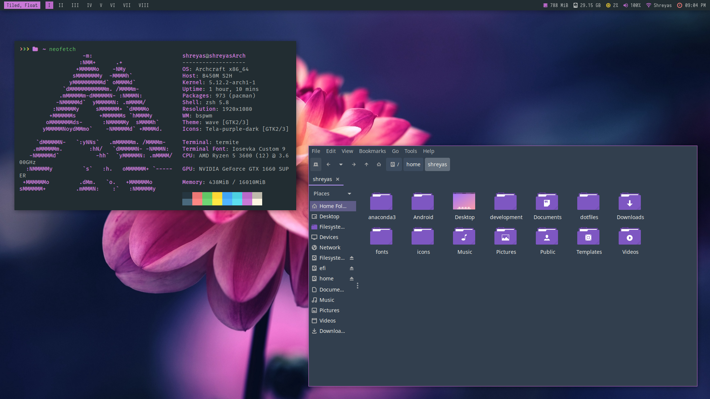
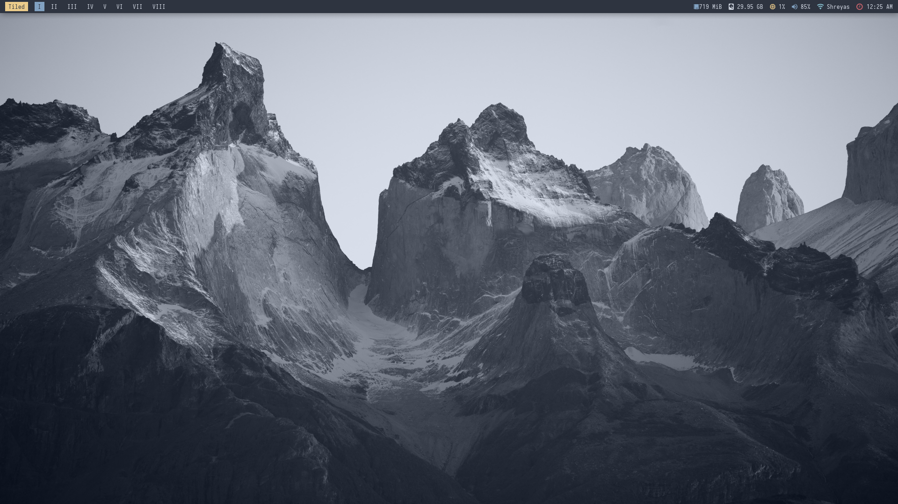
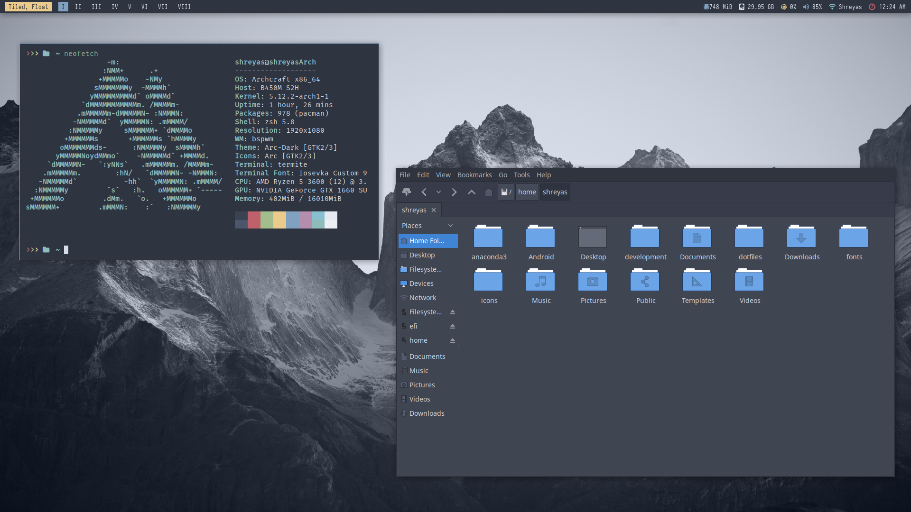
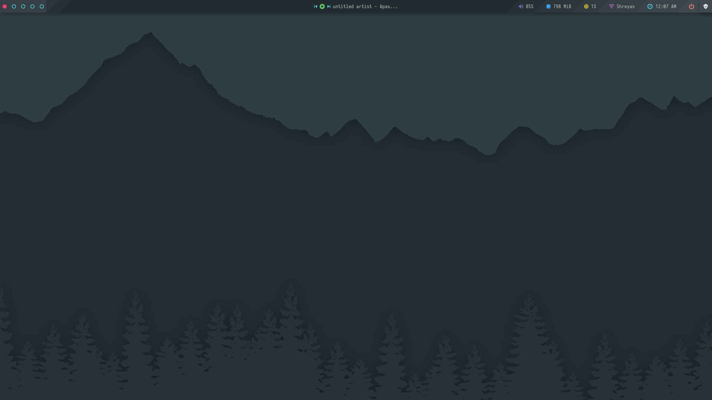
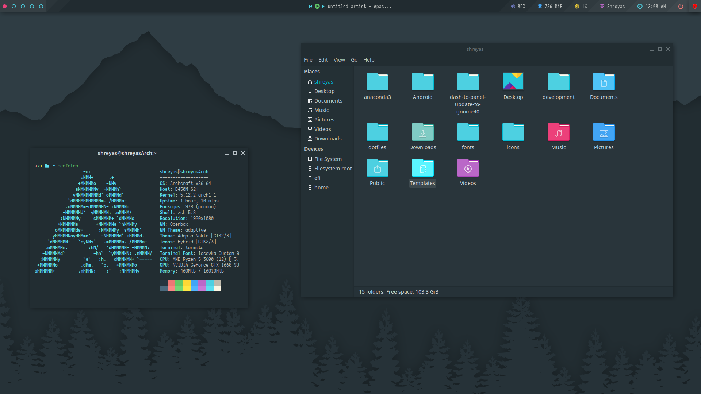
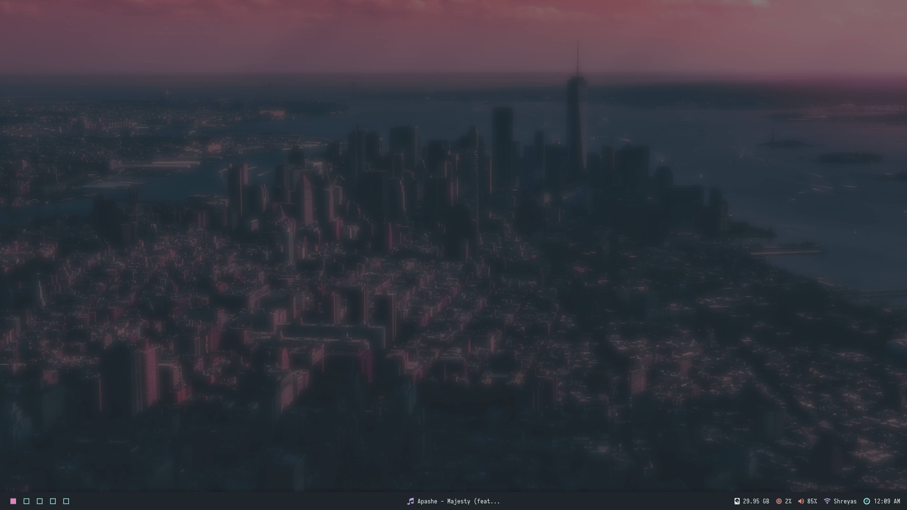
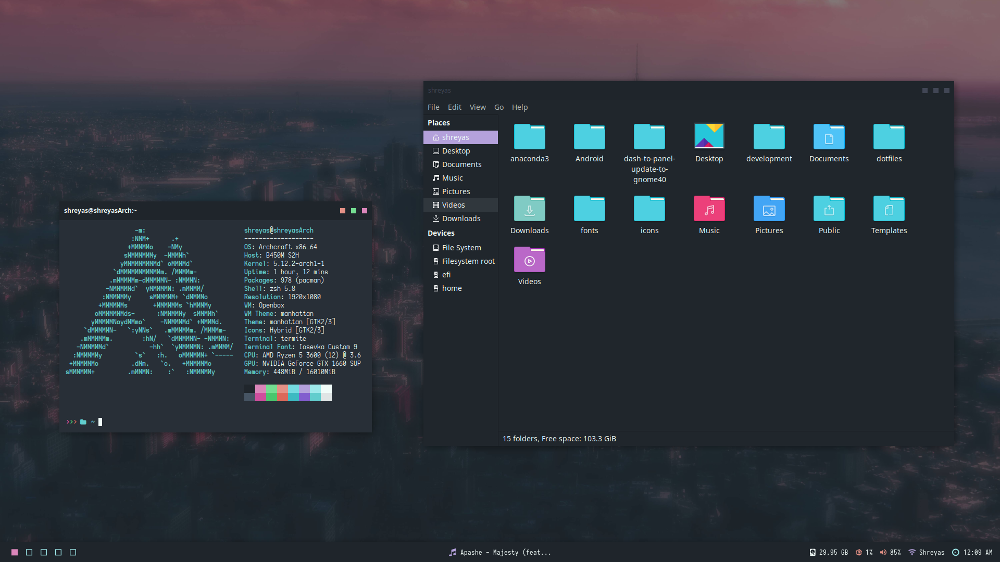
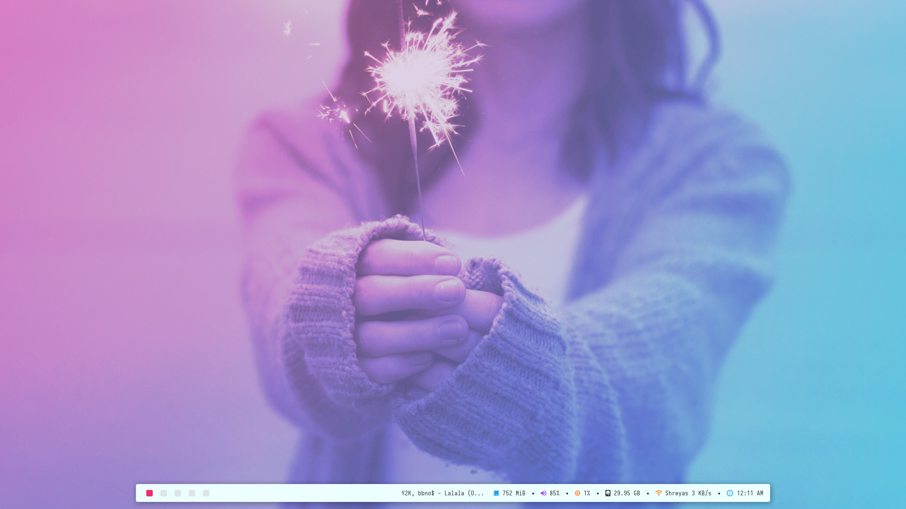
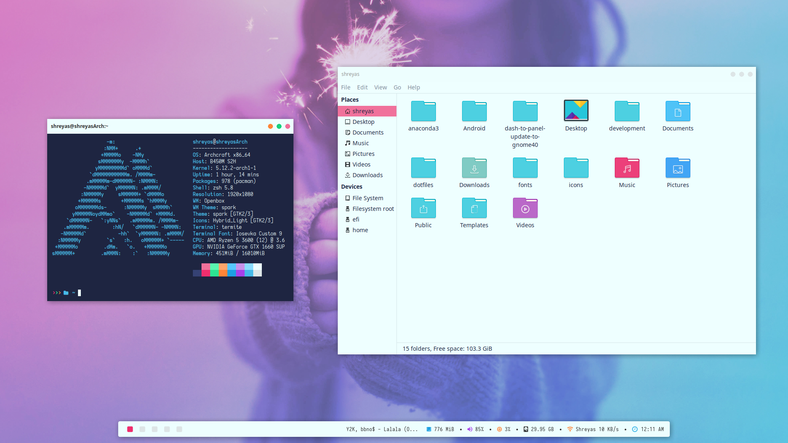

# My Dotfiles
This desktop is heavily inspired and created on [Archcraft](https://archcraft-os.github.io). Its a great minimal arch based distro with a gorgeous desktop. All credits go to the creator of that distro and I have just modified stuff on top of it to my liking. 

Do checkout https://github.com/adi1090x , he has contributed immensely to the Linux community.

## Screenshots

These are just a few screenshots of some of the possible themes. There are a lot more themes available and you can switch between them easily.

## BSPWM
   
   ### Dark
   
   
   
   
   
   ### Nord
   
   
   
   
   

## Openbox

   ### Default
   
   
   
   
   
   ### Manhattan

   
   
   
   
   ### Spark
   
   
   
   

## Steps to get my Desktop:
<ins>Note:</ins> The command to install the dependencies pertains only if you are on an Arch based system. If you are on an Ubuntu/debian based distro, all the dependencies are available except for obmenu-generator and polybar(if you are using Ubuntu 20.04). 

For Obmenu-generator, follow the instructions to install it from source : https://github.com/trizen/obmenu-generator

For polybar, you can build it from source here : https://github.com/polybar/polybar 

1) Install the following dependencies(if you use an arch based system)

   `yay -S Openbox BSPWM polybar rofi dunst mpd ncmpcpp dmenu geany obmenu-generator ranger kitty compton zsh oh-my-zsh nitrogen lxappearance`

(If you use a different AUR helper like paru , please use it accordingly. I am using the AUR to install most of the packages as some of the patched packages are not available in the official repos)

2) Move Backgrounds folder to `/usr/share/backgrounds`

3) Move Themes folder to `/usr/share/themes`

4) Move icons folder to `/usr/share/icons`

5) Move `.mpd,.ncmpcpp,.Xresources.d,.Xresources,.zshrc` to your home directory

6) Copy the contents of the .config folder and paste them in `~/.config/`

7) Some of the fonts to install- Fira mono for powerline, Cascadia code, iosevka nerd font, Dejavu sans, Source code pro(Or copy the contents of the fonts folder and paste it in /usr/share/fonts)

8) Copy the contents of bin and paste them in `/usr/bin`

9) Copy the archlabs folder and paste it in `/usr/lib`

10) That's it! you should be good to go now. Reboot once just to be safe and login to your new system

## Tips

1) I have kept the keybindings common between both the BSPWM as well as openbox desktop to get a better experience. Do change them as per your requirements. 

   To change the keybindings on BSPWM and Openbox, edit the sxhkdrc file in `~/.config/sxhkd` and `~/.config/openbox/rc.xml` respectively.

2) You can change the themes on bspwm with the keybind Ctrl+Alt+T and you can use the Obmenu on openbox to do the same.

3) If for some reason you find the gtk-theme or icons not changing with change in global theme, open lxappearance either from rofi or from the terminal and change the theme accordingly.

